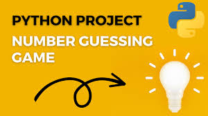

# Number-Guessing-Game
>
# Project Title
### Number Guessing Game
# Description
The Number Guessing Game is a simple Python project designed to demonstrate basic programming concepts and provide an engaging way to practice coding skills. The objective of the game is for the player to guess a randomly generated number within a specified range, receiving feedback on each guess until the correct number is identified.
# Methodology
1. **Random Number Generation**:

The game generates a random number within a predefined range using Python's random module.

2. **User Input**:

The player is prompted to enter their guess, and the input is validated to ensure it is a valid number within the specified range.

3. **Feedback Mechanism**:

After each guess, the game provides feedback indicating whether the guess is too low, too high, or correct.

4. **Loop Structure**:

The game uses a loop to allow the player to continue guessing until the correct number is guessed.

5. **Endgame Conditions**:

Once the correct number is guessed, the game congratulates the player and displays the number of attempts made.
